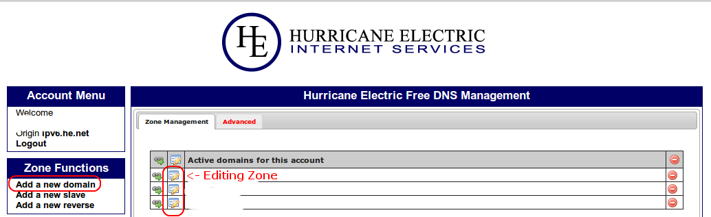
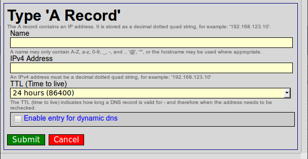
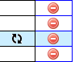
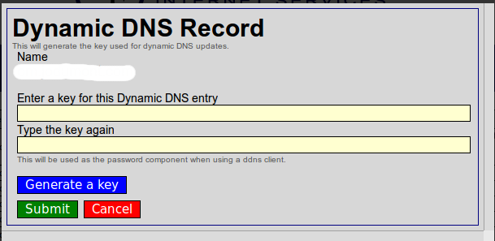

# REQUIREMENTS
```sh
$ apt-get install -y dnstools curl
```
> [!TIP]
> Currently, as of 2024-11, the `dnstools` package seems to be changed to `dnsutils` in newer versions of Debian such as Debian Bookworm 12.x.

# DynDNS with HE.NET  
## How to Make your own DynDNS for Free with HE.NET and CURL
*If you want a Windows version <a href="https://github.com/bennettp123/dns.he.net-updater">PowerShell updater for dns.he.net </a>*

### 1. Create an acount on <a href="https://dns.he.net">dns.he.net</a>  

### 2. At your Registrer, change your Nameservers for :  
  - ns1.het.net
  - ns2.het.net
  - ns3.het.net
  - ns4.het.net
  - ns5.het.net

### 3. Under Zone Functions, add a new domain  


### 4. Edit your Zone and Add a A Record
*Dont forget to Enable this entry for dynamic dns*  


### 5. Generate a password for this DNS Record
by clicking on 
  

then  
  

-----

## 6. Copy the script On the Client site (Home Machine)
```sh
$ curl -O https://raw.githubusercontent.com/opi/DynDNS-with-HE.NET/refs/heads/master/update_dns-he-net.sh  
$ chmod 700 update_dns-he-net.sh
```

### 7. Adjust the $VARIABLE
```sh
$ nano update_dns-he-net.sh
```
In the opened file, replace the `_DYNAMIC_DOMAIN_NAME_TO_UPDATE_` text with your domain name that you added in step 3, and the `_PASSWORD_GENERATE_FOR_THIS_DNS_RECORD_` text with your key that you generated in step 5 in **dns.he.net** account.

### 8. CRON it
```sh
$ crontab -e
*/5 * * * * /_CHOOSE_YOUR_OWN_PATH_/update_dns-he-net.sh >/dev/null 2>&1
```
  
